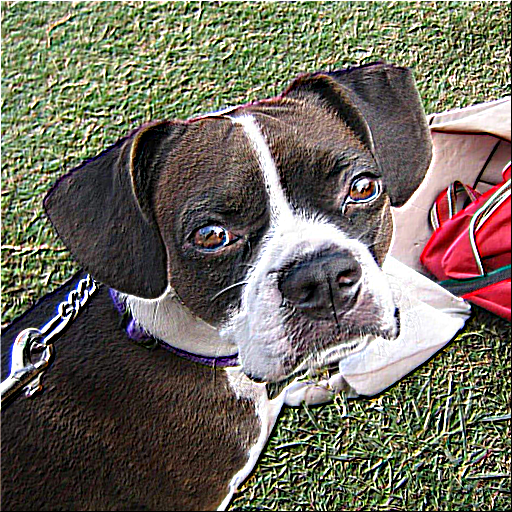
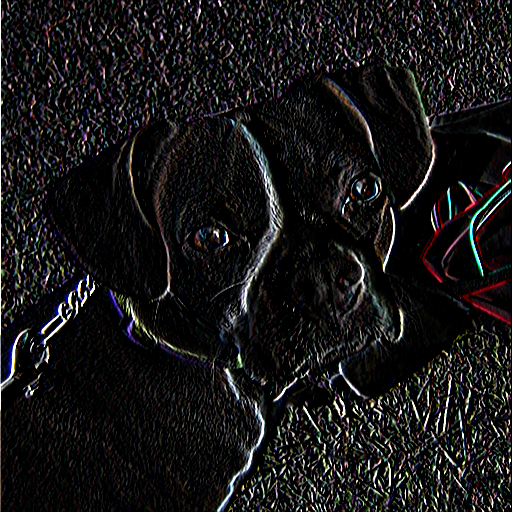

# ImageProcessor

A lightweight C++ image processing library. Supports basic editing operations (invert, grayscale, brightness, filters, blending, kernels, etc.) with a simple object-oriented interface.

---

## Features

- Load and save images (PNG, JPG, BMP)
- Pixel-level access via `ImageData`
- Image operations:
  - Grayscale, thresholding, inversion
  - Brightness, contrast, tint, noise
- Geometry:
  - Flip, rotate, resize, crop
- Compositing:
  - Blend, multiply, screen, overlay, add/subtract/difference
- Convolution filters:
  - Box blur, Gaussian blur, Sobel, Laplacian, sharpen, emboss
- Custom kernel support (fixed-size or dynamic)

---

## A Few Example Outputs

### Unedited input images
<p float="left">
  
  
</p>

### Invert
<p float="left">
  
  
</p>

### Noise
<p float="left">
  
  
</p>

### Threshold
<p float="left">
  
  
</p>

### Emboss Kernel
<p float="left">
  
  
</p>

### Sobel Kernel
<p float="left">
  
  
</p>

### Max and Min Composition
<p float="left">
  
  
</p>

### Add and Subtract Composition
<p float="left">
  
  
</p>

---

## Project Structure

```
ImageProcessor/
├── CMakeLists.txt
├── inc/
│   ├── ImageData.h
│   └── stb/
│       ├── stb_image.h
│       └── stb_image_write.h
├── src/
│   ├── main.cpp
│   └── stb/
│       ├── stb_image.cpp
│       └── stb_image_write.cpp
├── input/
│   ├── cat.jpg
│   └── dog.jpg
└── output/
```

---

### Prerequisites
- CMake ≥ 3.16  
- C++20-compatible compiler

### Build Instructions

```bash
# Clone the repo
git clone https://github.com/<yourusername>/ImageProcessor.git
cd ImageProcessor

# Configure the build
cmake -B build -S .

# Build the executable
cmake --build build --config Release

# Run
./bin/ImageProcessor
```

---

## Example Usage

```cpp
#include "ImageData.h"

int main() {
    ImageData img;
    img.loadImage("input/dog.jpg");

    img.invert();
    img.saveImage("output/dog_inverted.png", ImageFormat::PNG);

    return 0;
}
```

---

## CMake Notes

The provided `CMakeLists.txt`:
- Builds the project as a standalone executable.
- Includes both the `inc/` and `inc/stb/` directories.
- Automatically creates the `output/` directory after build.

---

## Dependencies

- [stb_image.h](https://github.com/nothings/stb/blob/master/stb_image.h)  
- [stb_image_write.h](https://github.com/nothings/stb/blob/master/stb_image_write.h)

Both are included locally in `inc/stb/`.

---
